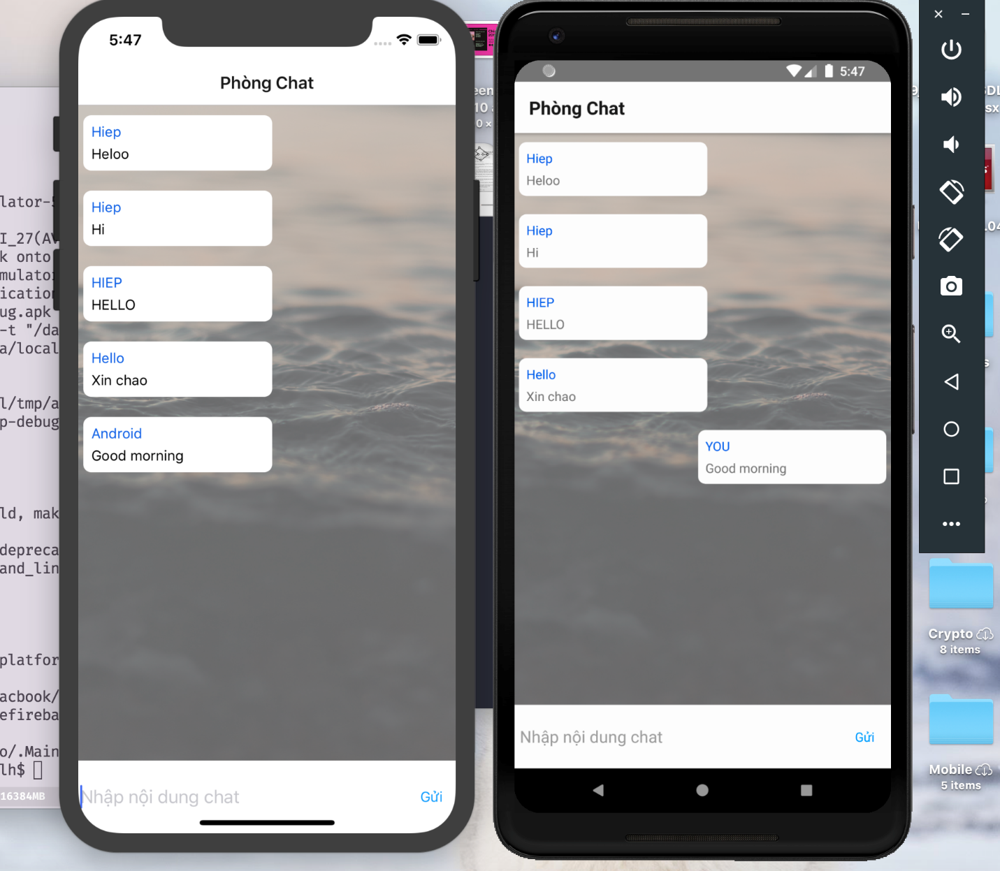

# simple-chatapp-firebase

## Demo image

  

## Go to project folder and install all libary:

`npm install `

## Run at Android Simulator:

`react-native run-android`

## Run at IOS Simulator:

`react-native run-ios`
